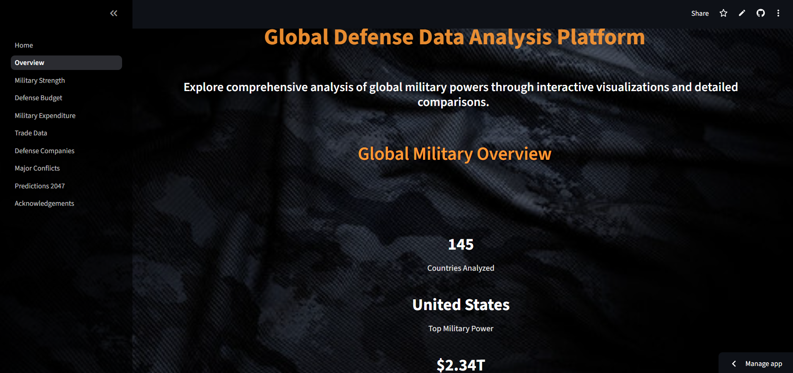

# The Art Of War 

In an era of complex geopolitical dynamics, understanding global military landscapes is more critical than ever. Our **Military Data Analysis Platform** provides a comprehensive, data-driven exploration of global military power. Using interactive visualizations, this platform deciphers trends in defense spending, international arms trade, and historical conflicts, offering clear insights into the forces shaping global security.


## Contributors


1.  **Divya Sharma** 
         
      Global Power Overview 
2.  **Abhinandan Singh Baghel**
      
      Military Strength Comparison
3.  **Devansh Mehta**

      Defense Budgets 
4.  **Ujjaval Patel**

      Military Expenditure
5.  **Abhijeet Rajput**

      Trade Data Analysis
6. **Vishal Kumar**

      Defense Companies
7. **Sohel Modi**

      Historical Conflicts Analysis
8. **Kamal Kant Tripathi**

      Future Power Projections


-----

# Global Military Power Overview

This interactive world map provides a high-level view of military strength across the globe. Features include:

  - Color-coded map for quick assessment of military power indices.
  - Hover-over tooltips with key statistics for each country.
  - Filters to customize the data displayed on the map.





-----

# Country vs. Country Strength Comparison

Select any two nations to generate a direct, side-by-side comparison of their military capabilities. The dashboard visualizes:

  - Total active and reserve personnel.
  - Equipment inventories across air, land, and sea.
  - Logistical capabilities and resource availability.


-----


# Defense Budget  Analysis

Track and compare defense spending trends over time for different countries. This module helps uncover:

  - Year-over-year changes in national defense budgets.
  - Military spending as a percentage of GDP.
  - Sunburst charts showing budget allocation across different military branches.


-----

# Military Expenditure Visualization (1960-2018)

- Track and compare the defense spending of various nations over nearly six decades.

- Visualize expenditure over time with interactive line charts.

- Select multiple countries for direct comparison.

- Analyze spending patterns and arms race dynamics.


----

# Global Defense Trade

Explore the global flow of military hardware with interactive visualizations of import and export data. Key insights include:

  - Top arms exporting and importing countries.
  - Sankey diagrams showing trade relationships between nations.
  - Analysis of the types of military equipment being traded.


-----


# Defense Companies Analysis (2005-2020)

- Explore the evolution of the world's top defense companies through animated and interactive charts.

- Animated bubble charts showing company growth over time.

- Analyze trends in defense revenue and market share.

- Compare the performance of companies from different countries.


------

# Historical Major Conflicts Dashboard

Analyze significant military conflicts throughout history to understand their scale and impact. This section allows users to:

  - Filter conflicts by region, decade, or participating nations.
  - View timelines and key events for each major war.
  - Visualize data on casualties and economic impact.


-----


# Future Power Projections (2047)

This predictive analytics module forecasts potential shifts in global military power by the year 2047. The model considers:

  - Economic growth projections (GDP).
  - Population and demographic trends.
  - Current technological and military investment rates.


-----

## Running the App
1. Clone or unzip the project.
2. Install dependencies:
   ```
   pip install -r requirements.txt
   ```
3. Run the home page:
   ```
   streamlit run Home.py
   ```
4. Use the sidebar to navigate between pages.


**Deployed Application:**
`https://theartofwar-rbuybzjjop7qrupggfvmr4.streamlit.app/`


